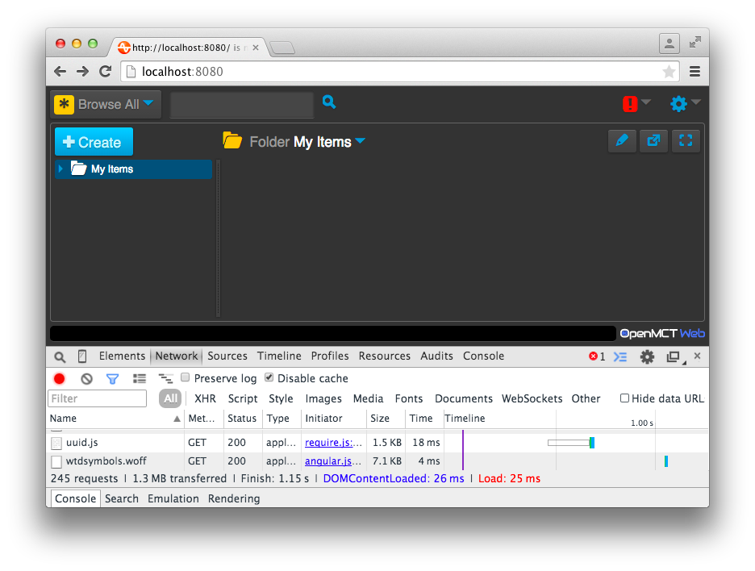
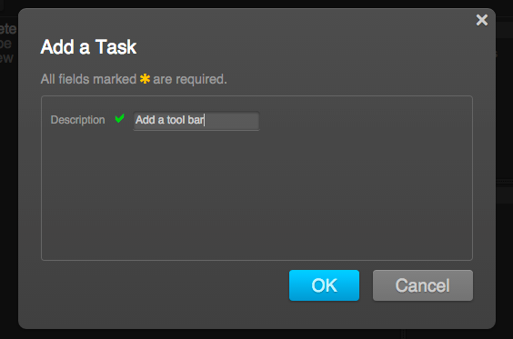
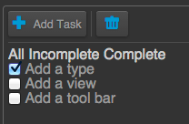
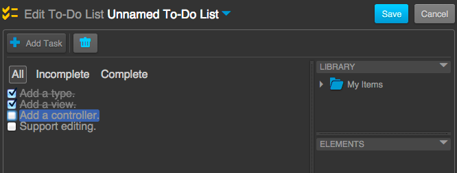
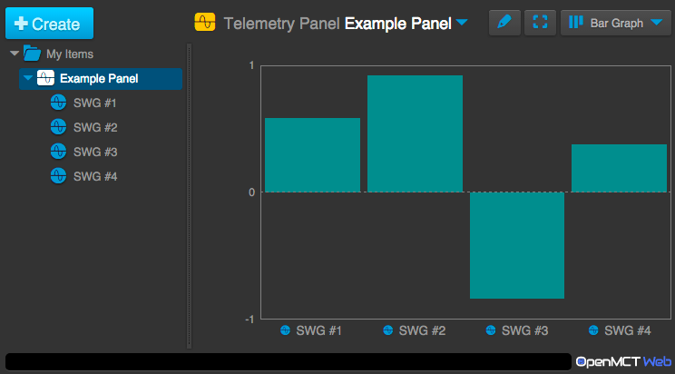
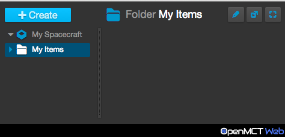
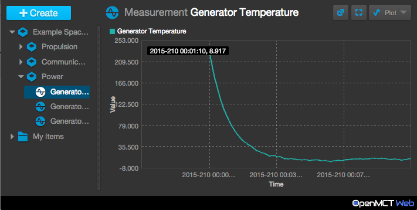

# Open MCT Web Tutorials

Victor Woeltjen
victor.woeltjen@nasa.gov

October 14, 2015
Document Version 2.2

Date             | Version | Summary of Changes                | Author
---------------- | ------- | --------------------------------- | --------------- 
May 12, 2015     | 0       | Initial Draft                     | Victor Woeltjen
June 4, 2015     | 1.0     | Name changes                      | Victor Woeltjen
July 28, 2015    | 2.0     | Telemetry adapter tutorial        | Victor Woeltjen
July 31, 2015    | 2.1     | Clarify telemetry adapter details | Victor Woeltjen
October 14, 2015 | 2.2     | Conversion to markdown            | Andrew Henry

# Introduction

## This document
This document contains a number of code examples in formatted code blocks. In 
many cases these code blocks are repeated in order to highlight code that has 
been added or removed as part of the tutorial. In these cases, any lines added 
will be indicated with a '+' at the start of the line. Any lines removed will 
be indicated with a '-'.

## Setting Up Open MCT Web

In this section, we will cover the steps necessary to get a minimal Open MCT Web 
developer environment up and running. Once we have this, we will be able to 
proceed with writing plugins as described in this tutorial.

### Prerequisites

This tutorial assumes you have the following software installed. Version numbers 
record what was used in writing this tutorial; the same steps should work with 
more recent versions, but this cannot be guaranteed.

* Node.js v0.12.2: https://nodejs.org/
* git v1.8.3.4: http://git-scm.com/
* Google Chrome v42: https://www.google.com/chrome/
* A text editor.

Open MCT Web can be run without any of these tools, provided suitable 
alternatives are taken; see the [Open MCT Web Developer Guide](../guide/index.md) 
for a more general overview of how to run and deploy a Open MCT Web application.

### Check out Open MCT Web Sources

First step is to check out Open MCT Web from the source repository. 

`git clone https://github.com/nasa/openmctweb.git openmctweb`

This will create a copy of the Open MCT Web source code repository in the folder 
`openmctweb` (relative to the path from which you ran the command.)
If you have a repository URL, use that as the "path to repo" above. Alternately, 
if you received Open MCT Web as a git bundle, the path to that bundle on the 
local filesystem can be used instead.
At this point, it will also be useful to branch off of Open MCT Web v0.6.2 
(which was used when writing these tutorials) to begin adding plugins.

    cd openmctweb
	git branch <my branch name> open-v0.6.2
	git checkout <my branch name>

### Configuring Persistence

In its default configuration, Open MCT Web will try to use ElasticSearch 
(expected to be deployed at /elastic on the same HTTP server running Open MCT 
Web) to persist user-created domain objects. We don't need that for these 
tutorials, so we will replace the ElasticSearch plugin with the example 
persistence plugin. This doesn't actually persist, so anything we create within 
Open MCT Web will be lost on reload, but that's fine for purposes of these 
tutorials.

To change this configuration, edit bundles.json (at the top level of the Open 
MCT Web repository) and replace platform/persistence/elastic with 
example/persistence.

#### Bundle Before
```diff
[
    "platform/framework",
    "platform/core",
    "platform/representation",
    "platform/commonUI/about",
    "platform/commonUI/browse",
    "platform/commonUI/edit",
    "platform/commonUI/dialog",
    "platform/commonUI/general",
    "platform/containment",
    "platform/telemetry",
    "platform/features/layout",
    "platform/features/pages",
    "platform/features/plot",
    "platform/features/scrolling",
    "platform/forms",
    "platform/persistence/queue",
-   "platform/persistence/elastic",
    "platform/policy",

    "example/generator"
]
```
__bundles.json__

#### Bundle After
```diff
[
    "platform/framework",
    "platform/core",
    "platform/representation",
    "platform/commonUI/about",
    "platform/commonUI/browse",
    "platform/commonUI/edit",
    "platform/commonUI/dialog",
    "platform/commonUI/general",
    "platform/containment",
    "platform/telemetry",
    "platform/features/layout",
    "platform/features/pages",
    "platform/features/plot",
    "platform/features/scrolling",
    "platform/forms",
    "platform/persistence/queue",
    "platform/policy",

+   "example/persistence",
    "example/generator"
]
```
__bundles.json__
	
### Run a Web Server

The next step is to run a web server so that you can view the Open MCT Web 
client (including the plugins you add to it) in browser. Any web server can 
be used for hosting OpenMCTWeb, and a trivial web server is provided in this 
package for the purposes of running the tutorials. The provided web server 
should not be used in a production environment
  
To run the tutorial web server

    node app.js

### Viewing in Browser

Once running, you should be able to view Open MCT Web from your browser at 
http://localhost:8080/ (assuming the web server is running on port 8080, 
and OpenMCTWeb is installed at the server's root path). 
[Google Chrome](https://www.google.com/chrome/) is recommended for these 
tutorials, as Chrome is Open MCT Web's "test-to" browser. The browser cache 
can sometimes interfere with development (masking changes by 
using older versions of sources); to avoid this, it is easiest to run Chrome 
with Developer Tools expanded, and "Disable cache" selected from the Network 
tab, as shown below.



# Tutorials

These tutorials cover three of the common tasks in Open MCT Web:

* The "to-do list" tutorial illustrates how to add a new application feature.
* The "bar graph" tutorial illustrates how to add a new telemetry visualization.
* The "data set reader" tutorial illustrates how to integrate with a telemetry 
backend.

## To-do List

The goal of this tutorial is to add a new application feature to Open MCT Web: 
To-do lists. Users should be able to create and manage these to track items that 
they need to do. This is modelled after the to-do lists at http://todomvc.com/.

### Step 1-Create the Plugin

The first step to adding a new feature to Open MCT Web is to create the plugin 
which will expose that feature. A plugin in Open MCT Web is represented by what 
is called a bundle; a bundle, in turn, is a directory which contains a file 
bundle.json, which in turn describes where other relevant sources & resources 
will be. The syntax of this file is described in more detail in the Open MCT Web 
Developer Guide.

We will create this file in the directory tutorials/todo (we can hereafter refer 
to this plugin as tutorials/todo as well.) We will start with an "empty bundle", 
one which exposes no extensions - which looks like:

```diff
{
    "name": "To-do Plugin",
    "description": "Allows creating and editing to-do lists.",
    "extensions": {

    }
}
```
__tutorials/todo/bundle.json__

We will also include this in our list of active bundles.

#### Before
```diff
[
    "platform/framework",
    "platform/core",
    "platform/representation",
    "platform/commonUI/about",
    "platform/commonUI/browse",
    "platform/commonUI/edit",
    "platform/commonUI/dialog",
    "platform/commonUI/general",
    "platform/containment",
    "platform/telemetry",
    "platform/features/layout",
    "platform/features/pages",
    "platform/features/plot",
    "platform/features/scrolling",
    "platform/forms",
    "platform/persistence/queue",
    "platform/policy",

    "example/persistence",
    "example/generator"
]
```
__bundles.json__

#### After

```diff
[
    "platform/framework",
    "platform/core",
    "platform/representation",
    "platform/commonUI/about",
    "platform/commonUI/browse",
    "platform/commonUI/edit",
    "platform/commonUI/dialog",
    "platform/commonUI/general",
    "platform/containment",
    "platform/telemetry",
    "platform/features/layout",
    "platform/features/pages",
    "platform/features/plot",
    "platform/features/scrolling",
    "platform/forms",
    "platform/persistence/queue",
    "platform/policy",

    "example/persistence",
    "example/generator",

+   "tutorials/todo"     
]
```    
__bundles.json__

At this point, we can reload Open MCT Web. We haven't introduced any new 
functionality, so we don't see anything different, but if we run with logging 
enabled ( http://localhost:8080/?log=info ) and check the browser console, we 
should see:

`Resolving extensions for bundle tutorials/todo(To-do Plugin)`

...which shows that our plugin has loaded.

### Step 2-Add a Domain Object Type

Features in a Open MCT Web application are most commonly expressed as domain 
objects and/or views thereof. A domain object is some thing that is relevant to 
the work that the Open MCT Web application is meant to support. Domain objects 
can be created, organized, edited, placed in layouts, and so forth. (For a 
deeper explanation of domain objects, see the Open MCT Web Developer Guide.)

In the case of our to-do list feature, the to-do list itself is the thing we'll 
want users to be able to create and edit. So, we will add that as a new type in 
our bundle definition:
```diff    
{
    "name": "To-do Plugin",
    "description": "Allows creating and editing to-do lists.",
    "extensions": {
+      "types": [
+          {
+              "key": "example.todo",
+              "name": "To-Do List",
+              "glyph": "j",
+              "description": "A list of things that need to be done.",
+              "features": ["creation"]
+          }
        ]
    }
}
```
__tutorials/todo/bundle.json__

What have we done here? We've stated that this bundle includes extensions of the 
category _types_, which is used to describe domain object types. Then, we've 
included a definition for one such extension, which is the to-do list object.

Going through the properties we've defined:

* The `key` of `example.todo` will be stored as the machine-readable name for 
domain objects of this type.
* The `name` of "To-Do List" is the human-readable name for this type, and will 
be shown to users.
* The `glyph` refers to a special character in Open MCT Web's custom font set; 
this will be used as an icon.
* The `description` is also human-readable, and will be used whenever a longer 
explanation of what this type is should be shown.
* Finally, the `features` property describes some special features of objects of 
this type. Including `creation` here means that we want users to be able to 
create this (in other cases, we may wish to expose things as domain objects 
which aren't user-created, in which case we would omit this.)

If we reload Open MCT Web, we see that our new domain object type appears in the 
Create menu:


At this point, our to-do list doesn't do much of anything; we can create them 
and give them names, but they don't have any specific functionality attached, 
because we haven't defined any yet.

### Step 3-Add a View

In order to allow a to-do list to be used, we need to define and display its 
contents. In Open MCT Web, the pattern that the user expects is that they'll 
click on an object in the left-hand tree, and see a visualization of it to the 
right; in Open MCT Web, these visualizations are called views.
A view in Open MCT Web is defined by an Angular template. We'll add that in the 
directory `tutorials/todo/res/templates` (`res` is, by default, the directory 
where bundle-related resources are kept, and `templates` is where HTML templates 
are stored by convention.)

```diff
<div>
    <a href="">All</a>
    <a href="">Incomplete</a>
    <a href="">Complete</a>
</div>

<ul>
    <li ng-repeat="task in model.tasks">
        <input type="checkbox" ng-checked="task.completed">
        {{task.description}}
    </li>
</ul>
```

__tutorials/todo/res/templates/todo.html__

A summary of what's included:

* At the top, we have some buttons that we will later wire in to allow the user 
to filter down to either complete or incomplete tasks.
* After that, we have a list of tasks. The scope variable `model` is the model 
of the domain object being viewed; this contains all of the persistent state 
associated with that object. This model is effectively just a JSON document, so 
we can choose what goes into it (so long as we take care not to collide with 
platform-defined properties; see the Open MCT Web Developer Guide.) Here, we 
assume that all tasks will be stored in a property `tasks`, and that each will be 
an object containing a `description` (the readable summary of the task) and a 
boolean `completed` flag.

To expose this view in Open MCT Web, we need to declare it in our bundle 
definition:

```diff
{
    "name": "To-do Plugin",
    "description": "Allows creating and editing to-do lists.",
    "extensions": {
        "types": [
            {
                "key": "example.todo",
                "name": "To-Do List",
                "glyph": "j",
                "description": "A list of things that need to be done.",
                "features": ["creation"]
            }
        ],
+       "views": [
+           {
+               "key": "example.todo",
+               "type": "example.todo",
+               "glyph": "j",
+               "name": "List",
+               "templateUrl": "templates/todo.html"
+           }
+       ]
    }
}
```
__tutorials/todo/bundle.json__

Here, we've added another extension, this time belonging to category `views`. It 
contains the following properties:

* Its `key` is its machine-readable name; we've given it the same name here as 
the domain object type, but could have chosen any unique name. 

* The `type` property tells Open MCT Web that this view is only applicable to 
domain objects of that type. This means that we'll see this view for To-do Lists 
that we create, but not for other domain objects (such as Folders.)

* The `glyph` and `name` properties describe the icon and human-readable name 
for this view to display in the UI where needed (if multiple views are available 
for To-do Lists, the user will be able to choose one.)

* Finally, the `templateUrl` points to the Angular template we wrote; this path is 
relative to the bundle's `res` folder.

This template looks like it should display tasks, but we don't have any way for 
the user to create these yet. As a temporary workaround to test the view, we 
will specify an initial state for To-do List domain object models in the 
definition of that type.

```diff
{
    "name": "To-do Plugin",
    "description": "Allows creating and editing to-do lists.",
    "extensions": {
        "types": [
            {
                "key": "example.todo",
                "name": "To-Do List",
                "glyph": "j",
                "description": "A list of things that need to be done.",
                "features": ["creation"],
+               "model": {
+                   "tasks": [
+                       { "description": "Add a type", "completed": true },
+                       { "description": "Add a view" }
+                   ]
                }
            }
        ],
        "views": [
            {
                "key": "example.todo",
                "type": "example.todo",
                "glyph": "j",
                "name": "List",
                "templateUrl": "templates/todo.html"
            }
        ]
    }
}
```
__tutorials/todo/bundle.json__

Now, when To-do List objects are created in Open MCT Web, they will initially 
have the state described by that model property.

If we reload Open MCT Web, create a To-do List, and navigate to it in the tree, 
we should now see:


This looks roughly like what we want. We'll handle styling later, so let's work 
on adding functionality. Currently, the filter choices do nothing, and while the 
checkboxes can be checked/unchecked, we're not actually making the changes in 
the domain object - if we click over to My Items and come back to our 
To-Do List, for instance, we'll see that those check boxes have returned to 
their initial state.

### Step 4-Add a Controller

We need to do some scripting to add dynamic behavior to that view. In 
particular, we want to:

* Filter by complete/incomplete status.
* Change the completion state of tasks in the model.

To do this, we will support this by adding an Angular controller. (See 
https://docs.angularjs.org/guide/controller for an overview of controllers.) 
We will define that in an AMD module (see http://requirejs.org/docs/whyamd.html) 
in the directory `tutorials/todo/src/controllers` (`src` is, by default, the 
directory where bundle-related source code is kept, and controllers is where 
Angular controllers are stored by convention.)
```diff
define(function () {
    function TodoController($scope) {
        var showAll = true,
            showCompleted;

        // Persist changes made to a domain object's model
        function persist() {
            var persistence = 
                $scope.domainObject.getCapability('persistence');
            return persistence && persistence.persist();
        }

        // Change which tasks are visible
        $scope.setVisibility = function (all, completed) {
            showAll = all;
            showCompleted = completed;
        };

        // Toggle the completion state of a task
        $scope.toggleCompletion = function (taskIndex) {
            $scope.domainObject.useCapability('mutation', function (model) {
                var task = model.tasks[taskIndex];
                task.completed = !task.completed;
            });
            persist();
        };

        // Check whether a task should be visible
        $scope.showTask = function (task) {
            return showAll || (showCompleted === !!(task.completed));
        };
    }

    return TodoController;
});
```
__tutorials/todo/src/controllers/TodoController.js__

Here, we've defined three new functions and placed them in our `$scope`, which 
will make them available from the template:

* `setVisibility` changes which tasks are meant to be visible. The first argument 
is a boolean, which, if true, means we want to show everything; the second 
argument is the completion state we want to show (which is only relevant if the 
first argument is falsy.)

* `toggleCompletion` changes whether or not a task is complete. We make the 
change via the domain object's `mutation` capability, and then persist the 
change via its `persistence` capability. See the Open MCT Web Developer Guide 
for more information on these capabilities.

* `showTask` is meant to be used to help decide if a task should be shown, based 
on the current visibility settings. It is true when we have decided to show 
everything, or when the completion state matches the state we've chosen. (Note 
the use of the double-not !! to coerce the completed flag to a boolean, for 
equality testing.)

Note that these functions make reference to `$scope.domainObject;` this is the 
domain object being viewed, which is passed into the scope by Open MCT Web 
prior to our template being utilized.

On its own, this controller merely exposes these functions; the next step is to 
use them from our template:

```diff
+  <div ng-controller="TodoController">
        <div>
+          <a ng-click="setVisibility(true)">All</a>
+          <a ng-click="setVisibility(false, false)">Incomplete</a>
+          <a ng-click="setVisibility(false, true)">Complete</a>
        </div>
    
        <ul>
            <li ng-repeat="task in model.tasks"
+              ng-if="showTask(task)">
               <input type="checkbox"
                      ng-checked="task.completed"
+                     ng-click="toggleCompletion($index)">
                {{task.description}}
            </li>
        </ul>
+ </div>
```
__tutorials/todo/res/templates/todo.html__

Summary of changes here:

* First, we surround everything in a `div` which we use to utilize our 
`TodoController`. This `div` will also come in handy later for styling.
* From our filters at the top, we change the visibility settings when a different 
option is clicked.
* When showing tasks, we check with `showTask` to see if the task matches current 
filter settings.
* Finally, when the checkbox for a task is clicked, we make the change in the 
model via `toggleCompletion`.

If we were to try to run at this point, we'd run into problems because the 
`TodoController` has not been registered with Angular. We need to first declare 
it in our bundle definition, as an extension of category `controllers`:

```diff
{
    "name": "To-do Plugin",
    "description": "Allows creating and editing to-do lists.",
    "extensions": {
        "types": [
            {
                "key": "example.todo",
                "name": "To-Do List",
                "glyph": "j",
                "description": "A list of things that need to be done.",
                "features": ["creation"],
                "model": {
                    "tasks": [
                        { "description": "Add a type", "completed": true },
                        { "description": "Add a view" }
                    ]
                }
            }
        ],
        "views": [
            {
                "key": "example.todo",
                "type": "example.todo",
                "glyph": "j",
                "name": "List",
                "templateUrl": "templates/todo.html"
            }
        ],
+       "controllers": [
+           {
+               "key": "TodoController",
+               "implementation": "controllers/TodoController.js",
+               "depends": [ "$scope" ]
+           }
+       ]
    }
}
```
__tutorials/todo/bundle.json__

In this extension definition we have:

* A `key`, which again is a machine-readable identifier. This is the name that 
templates will reference.
* An `implementation`, which refers to an AMD module. The path is relative to the 
`src` directory within the bundle.
* The `depends` property declares the dependencies of this controller. Here, we 
want Angular to inject `$scope`, the current Angular scope (which, going back 
to our controller, is expected as our first argument.)

If we reload the browser now, our To-do List looks much the same, but now we are 
able to filter down the visible list, and the changes we make will stick around 
if we go to My Items and come back.


### Step 5-Support Editing

We now have a somewhat-functional view of our To-Do List, but we're still 
missing some important functionality: Adding and removing tasks!

This is a good place to discuss the user interface style of Open MCT Web. Open 
MCT Web draws a distinction between "using" and "editing" a domain object; in 
general, you can only make changes to a domain object while in Edit mode, which 
is reachable from the button with a pencil icon. This distinction helps users 
keep these tasks separate.

The distinction between "using" and "editing" may vary depending on what domain 
objects or views are being used. While it may be convenient for a developer to 
think of "editing" as "any changes made to a domain object," in practice some of 
these activities will be thought of as "using." 

For this tutorial we'll consider checking/unchecking tasks as "using" To-Do 
Lists, and adding/removing tasks as "editing." We've already implemented the 
"using" part, in this case, so let's focus on editing.

There are two new pieces of functionality we'll want out of this step:

* The ability to add new tasks.
* The ability to remove existing tasks.

An Editing user interface is typically handled in a tool bar associated with a 
view. The contents of this tool bar are defined declaratively in a view's 
extension definition.

```diff
{
    "name": "To-do Plugin",
    "description": "Allows creating and editing to-do lists.",
    "extensions": {
        "types": [
            {
                "key": "example.todo",
                "name": "To-Do List",
                "glyph": "j",
                "description": "A list of things that need to be done.",
                "features": ["creation"],
                "model": {
                    "tasks": [
                        { "description": "Add a type", "completed": true },
                        { "description": "Add a view" }
                    ]
                }
            }
        ],
        "views": [
            {
                "key": "example.todo",
                "type": "example.todo",
                "glyph": "j",
                "name": "List",
                "templateUrl": "templates/todo.html",
+               "toolbar": {
+                   "sections": [
+                       {
+                           "items": [
+                               {
+                                   "text": "Add Task",
+                                   "glyph": "+",
+                                   "method": "addTask",
+                                   "control": "button"
+                               }
+                           ]
+                       },
+                       {
+                           "items": [
+                               {
+                                   "glyph": "Z",
+                                   "method": "removeTask",
+                                   "control": "button"
+                               }
+                           ]
+                       }
+                   ]
+               }
            }
        ],
        "controllers": [
            {
                "key": "TodoController",
                "implementation": "controllers/TodoController.js",
                "depends": [ "$scope" ]
            }
        ]
    }
}
```
__tutorials/todo/bundle.json__

What we've stated here is that the To-Do List's view will have a toolbar which 
contains two sections (which will be visually separated by a divider), each of 
which contains one button. The first is a button labelled "Add Task" that will 
invoke an `addTask` method; the second is a button with a glyph (which will appear 
as a trash can in Open MCT Web's custom font set) which will invoke a `removeTask` 
method. For more information on forms and tool bars in Open MCT Web, see the 
Open MCT Web Developer Guide.

If we reload and run Open MCT Web, we won't see any tool bar when we switch over 
to Edit mode. This is because the aforementioned methods are expected to be 
found on currently-selected elements; we haven't done anything with selections 
in our view yet, so the Open MCT Web platform will filter this tool bar down to 
all the applicable controls, which means no controls at all.

To support selection, we will need to make some changes to our controller:

```diff
define(function () {
+    // Form to display when adding new tasks
+    var NEW_TASK_FORM = {
+        name: "Add a Task",
+        sections: [{
+            rows: [{
+                name: 'Description',
+                key: 'description',
+                control: 'textfield',
+                required: true
+            }]
+        }]
+    };

+   function TodoController($scope, dialogService) {
        var showAll = true,
            showCompleted;

        // Persist changes made to a domain object's model
        function persist() {
            var persistence = 
                $scope.domainObject.getCapability('persistence');
            return persistence && persistence.persist();
        }

+       // Remove a task
+       function removeTaskAtIndex(taskIndex) {
+           $scope.domainObject.useCapability('mutation', function 
+       (model) {
+               model.tasks.splice(taskIndex, 1);
+           });
+           persist();
+       }

+       // Add a task
+       function addNewTask(task) {
+           $scope.domainObject.useCapability('mutation', function 
+           (model) {
+               model.tasks.push(task);
+           });
+           persist();
+       }

        // Change which tasks are visible
        $scope.setVisibility = function (all, completed) {
            showAll = all;
            showCompleted = completed;
        };

        // Toggle the completion state of a task
        $scope.toggleCompletion = function (taskIndex) {
            $scope.domainObject.useCapability('mutation', function (model) {
                var task = model.tasks[taskIndex];
                task.completed = !task.completed;
            });
            persist();
        };

        // Check whether a task should be visible
        $scope.showTask = function (task) {
            return showAll || (showCompleted === !!(task.completed));
        };

        // Handle selection state in edit mode
+       if ($scope.selection) {
+           // Expose the ability to select tasks
+           $scope.selectTask = function (taskIndex) {
+               $scope.selection.select({
+                   removeTask: function () {
+                       removeTaskAtIndex(taskIndex);
+                       $scope.selection.deselect();
+                   }
+               });
+           };

+           // Expose a view-level selection proxy
+           $scope.selection.proxy({
+               addTask: function () {
+                   dialogService.getUserInput(NEW_TASK_FORM, {})
+                       .then(addNewTask);
+               }
+           });
+       }
    }

    return TodoController;
});
```
__tutorials/todo/src/controllers/TodoController.js__

There are a few changes to pay attention to here. Let's review them:

* At the top, we describe the form that should be shown to the user when they 
click the _Add Task_ button. This form is described declaratively, and populates 
an object that has the same format as tasks in the `tasks` array of our 
To-Do List's model.
* We've added an argument to the `TodoController`: The `dialogService`, which is 
exposed by the Open MCT Web platform to handle showing dialogs.
* Some utility functions for handling the actual adding and removing of tasks. 
These use the `mutation` capability to modify the tasks in the To-Do List's 
model. 
* Finally, we check for the presence of a `selection` object in our scope. This 
object is provided by Edit mode to manage current selections for editing. When 
it is present, we expose a `selectTask` function to our scope to allow selecting 
individual tasks; when this occurs, we expose an object to `selection` which has 
a `removeTask` method, as expected by the tool bar we've defined. We additionally 
expose a view proxy, to handle view-level changes (e.g. not associated with any 
specific selected object); this has an `addTask` method, which again is expected 
by the tool bar we've defined.

Additionally, we need to make changes to our template to select specific tasks 
in response to some user gesture. Here, we will select tasks when a user clicks 
the description.
```diff
<div ng-controller="TodoController">
    <div>
        <a ng-click="setVisibility(true)">All</a>
        <a ng-click="setVisibility(false, false)">Incomplete</a>
        <a ng-click="setVisibility(false, true)">Complete</a>
    </div>

    <ul>
        <li ng-repeat="task in model.tasks"
            ng-if="showTask(task)">
            <input type="checkbox"
                   ng-checked="task.completed"
                   ng-click="toggleCompletion($index)">
+           <span ng-click="selectTask($index)">
                {{task.description}}
+           </span>
        </li>
    </ul>
</div>
```
__tutorials/todo/res/templates/todo.html__

Finally, the `TodoController` uses the `dialogService` now, so we need to 
declare that dependency in its extension definition:
```diff
{
    "name": "To-do Plugin",
    "description": "Allows creating and editing to-do lists.",
    "extensions": {
        "types": [
            {
                "key": "example.todo",
                "name": "To-Do List",
                "glyph": "j",
                "description": "A list of things that need to be done.",
                "features": ["creation"],
                "model": {
                    "tasks": [
                        { "description": "Add a type", "completed": true },
                        { "description": "Add a view" }
                    ]
                }
            }
        ],
        "views": [
            {
                "key": "example.todo",
                "type": "example.todo",
                "glyph": "j",
                "name": "List",
                "templateUrl": "templates/todo.html",
                "toolbar": {
                    "sections": [
                        {
                            "items": [
                                {
                                    "text": "Add Task",
                                    "glyph": "+",
                                    "method": "addTask",
                                    "control": "button"
                                }
                            ]
                        },
                        {
                            "items": [
                                {
                                    "glyph": "Z",
                                    "method": "removeTask",
                                    "control": "button"
                                }
                            ]
                        }
                    ]
                }
            }
        ],
        "controllers": [
            {
                "key": "TodoController",
                "implementation": "controllers/TodoController.js",
+               "depends": [ "$scope", "dialogService" ]
            }
        ]
    }
}
```
__tutorials/todo/bundle.json__

If we now reload Open MCT Web, we'll be able to see the new functionality we've 
added. If we Create a new To-Do List, navigate to it, and click the button with 
the Pencil icon in the top-right, we'll be in edit mode. We see, first, that our 
"Add Task" button appears in the tool bar:


If we click on this, we'll get a dialog allowing us to add a new task:



Finally, if we click on the description of a specific task, we'll see a new 
button appear, which we can then click on to remove that task:



As always in Edit mode, the user will be able to Save or Cancel any changes they have made. 
In terms of functionality, our To-Do List can do all the things we want, but the appearance is still lacking. In particular, we can't distinguish our current filter choice or our current selection state.

### Step 6-Customizing Look and Feel

In this section, our goal is to:

* Display the current filter choice.
* Display the current task selection (when in Edit mode.)
* Tweak the general aesthetics to our liking.
* Get rid of those default tasks (we can create our own now.)

To support the first two, we'll need to expose some methods for checking these 
states in the controller:

```diff
define(function () {
    // Form to display when adding new tasks
    var NEW_TASK_FORM = {
        name: "Add a Task",
        sections: [{
            rows: [{
                name: 'Description',
                key: 'description',
                control: 'textfield',
                required: true
            }]
        }]
    };

    function TodoController($scope, dialogService) {
        var showAll = true,
            showCompleted;

        // Persist changes made to a domain object's model
        function persist() {
            var persistence = 
                $scope.domainObject.getCapability('persistence');
            return persistence && persistence.persist();
        }

        // Remove a task
        function removeTaskAtIndex(taskIndex) {
            $scope.domainObject.useCapability('mutation', function (model) {
                model.tasks.splice(taskIndex, 1);
            });
            persist();
        }

        // Add a task
        function addNewTask(task) {
            $scope.domainObject.useCapability('mutation', function (model) {
                model.tasks.push(task);
            });
            persist();
        }

        // Change which tasks are visible
        $scope.setVisibility = function (all, completed) {
            showAll = all;
            showCompleted = completed;
        };

+       // Check if current visibility settings match
+       $scope.checkVisibility = function (all, completed) {
+           return showAll ? all : (completed === showCompleted);
+       };

        // Toggle the completion state of a task
        $scope.toggleCompletion = function (taskIndex) {
            $scope.domainObject.useCapability('mutation', function (model) {
                var task = model.tasks[taskIndex];
                task.completed = !task.completed;
            });
            persist();
        };

        // Check whether a task should be visible
        $scope.showTask = function (task) {
            return showAll || (showCompleted === !!(task.completed));
        };

        // Handle selection state in edit mode
        if ($scope.selection) {
            // Expose the ability to select tasks
            $scope.selectTask = function (taskIndex) {
                $scope.selection.select({
                    removeTask: function () {
                        removeTaskAtIndex(taskIndex);
                        $scope.selection.deselect();
                    },
+                   taskIndex: taskIndex
                });
            };

+           // Expose a check for current selection state
+           $scope.isSelected = function (taskIndex) {
+               return ($scope.selection.get() || {}).taskIndex === 
+               taskIndex;
+           };

            // Expose a view-level selection proxy
            $scope.selection.proxy({
                addTask: function () {
                    dialogService.getUserInput(NEW_TASK_FORM, {})
                        .then(addNewTask);
                }
            });
        }
    }

    return TodoController;
});
```
__tutorials/todo/src/controllers/TodoController.js__

A summary of these changes:

* `checkVisibility` has the same arguments as `setVisibility`, but instead of 
making a change, it simply returns a boolean true/false indicating whether those 
settings are in effect. The logic reflects the fact that the second parameter is 
ignored when showing all.
* To support checking for selection, the index of the currently-selected task is 
tracked as part of the selection object.
* Finally, an isSelected function is exposed which checks if the indicated task 
is currently selected, using the index from above.

Additionally, we will want to define some CSS rules in order to reflect these 
states visually, and to generally improve the appearance of our view. We add 
another file to the res directory of our bundle; this time, it is `css/todo.css` 
(with the `css` directory again being a convention.)

```diff
.example-todo div.example-button-group {
    margin-top: 12px;
    margin-bottom: 12px;
}

.example-todo .example-button-group a {
    padding: 3px;
    margin: 3px;
}

.example-todo .example-button-group a.selected {
    border: 1px gray solid;
    border-radius: 3px;
    background: #444;
}

.example-todo .example-task-completed .example-task-description {
    text-decoration: line-through;
    opacity: 0.75;
}

.example-todo .example-task-description.selected {
    background: #46A;
    border-radius: 3px;
}

.example-todo .example-message {
    font-style: italic;
}
```

__tutorials/todo/res/css/todo.css__

Here, we have defined classes and appearances for:

* Our filter choosers (`example-button-group`).
* Our selected and/or completed tasks (`example-task-description`).
* A message, which we will add next, to display when there are no tasks 
(`example-message`).

To include this CSS file in our running instance of Open MCT Web, we need to 
declare it in our bundle definition, this time as an extension of category 
`stylesheets`:
```diff
{
    "name": "To-do Plugin",
    "description": "Allows creating and editing to-do lists.",
    "extensions": {
        "types": [
            {
                "key": "example.todo",
                "name": "To-Do List",
                "glyph": "j",
                "description": "A list of things that need to be done.",
                "features": ["creation"],
                "model": {
                    "tasks": []
                }
            }
        ],
        "views": [
            {
                "key": "example.todo",
                "type": "example.todo",
                "glyph": "j",
                "name": "List",
                "templateUrl": "templates/todo.html",
                "toolbar": {
                    "sections": [
                        {
                            "items": [
                                {
                                    "text": "Add Task",
                                    "glyph": "+",
                                    "method": "addTask",
                                    "control": "button"
                                }
                            ]
                        },
                        {
                            "items": [
                                {
                                    "glyph": "Z",
                                    "method": "removeTask",
                                    "control": "button"
                                }
                            ]
                        }
                    ]
                }
            }
        ],
        "controllers": [
            {
                "key": "TodoController",
                "implementation": "controllers/TodoController.js",
                "depends": [ "$scope", "dialogService" ]
            }
        ],
+       "stylesheets": [
+           {
+               "stylesheetUrl": "css/todo.css"
+           }
+       ]
    }
}
```
__tutorials/todo/bundle.json__

Note that we've also removed our placeholder tasks from the `model` of the 
To-Do List's type above; now To-Do Lists will start off empty.

Finally, let's utilize these changes from our view's template:
```diff
+ <div ng-controller="TodoController" class="example-todo">
+     <div class="example-button-group">
+         <a ng-class="{ selected: checkVisibility(true) }"
             ng-click="setVisibility(true)">All</a>
+         <a ng-class="{ selected: checkVisibility(false, false) }"
             ng-click="setVisibility(false, false)">Incomplete</a>
+         <a ng-class="{ selected: checkVisibility(false, true) }"
             ng-click="setVisibility(false, true)">Complete</a>
      </div>

      <ul>
          <li ng-repeat="task in model.tasks"
+             ng-class="{ 'example-task-completed': task.completed }"
              ng-if="showTask(task)">
              <input type="checkbox"
                   ng-checked="task.completed"
                   ng-click="toggleCompletion($index)">
              <span ng-click="selectTask($index)"
+                 ng-class="{ selected: isSelected($index) }"
+                 class="example-task-description">
                {{task.description}}
              </span>
          </li>
      </ul>
+     <div ng-if="model.tasks.length < 1" class="example-message">
+          There are no tasks to show.
+     </div>
+ </div>
```
__tutorials/todo/res/templates/todo.html__

Now, if we reload our page and create a new To-Do List, we will initially see:


If we then go into Edit mode, add some tasks, and select one, it will now be 
much clearer what the current selection is (e.g. before we hit the remove button 
in the toolbar):



## Bar Graph

In this tutorial, we will look at creating a bar graph plugin for visualizing 
telemetry data. Specifically, we want some bars that raise and lower to match 
the observed state of real-time telemetry; this is particularly useful for 
monitoring things like battery charge levels.
It is recommended that the reader completes (or is familiar with) the To-Do 
List tutorial before completing this tutorial, as certain concepts discussed 
there will be addressed in more brevity here.

### Step 1-Define the View

Since the goal is to introduce a new view and expose it from a plugin, we will 
want to create a new bundle which declares an extension of category `views`. 
We'll also be defining some custom styles, so we'll include that extension as 
well. We'll be creating this plugin in `tutorials/bargraph`, so our initial 
bundle definition looks like:

```diff
{
    "name": "Bar Graph",
    "description": "Provides the Bar Graph view of telemetry elements.",
    "extensions": {
        "views": [
            {
                "name": "Bar Graph",
                "key": "example.bargraph",
                "glyph": "H",
                "templateUrl": "templates/bargraph.html",
                "needs": [ "telemetry" ],
                "delegation": true
            }
        ],
        "stylesheets": [
            {
                "stylesheetUrl": "css/bargraph.css"
            }
        ]
    }
}
```

__tutorials/bargraph/bundle.json__

The view definition should look familiar after the To-Do List tutorial, with 
some additions:

* The `needs` property indicates that this view is only applicable to domain 
objects with a `telemetry` capability. This ensures that this view is available 
for telemetry points, but not for other objects (like folders.)
* The `delegation` property indicates that the above constraint can be satisfied 
via capability delegation; that is, by domain objects which delegate the 
`telemetry` capability to their contained objects. This allows this view to be 
used for Telemetry Panel objects as well as for individual telemetry-providing 
domain objects.

For this tutorial, we'll assume that we've sketched out our template and CSS 
file ahead of time to describe the general look we want for the view. These 
look like:

```diff
<div class="example-bargraph">
    <div class="example-tick-labels">
        <div class="example-tick-label" style="bottom: 0%">High</div>
        <div class="example-tick-label" style="bottom: 50%">Middle</div>
        <div class="example-tick-label" style="bottom: 100%">Low</div>
    </div>

    <div class="example-graph-area">
        <div style="left: 0; width: 33.3%;" class="example-bar-holder">
            <div class="example-bar" style="top: 25%; bottom: 50%;">
            </div>
        </div>
        <div style="left: 33.3%; width: 33.3%;" class="example-bar-holder">
            <div class="example-bar" style="top: 40%; bottom: 10%;">
            </div>
        </div>
        <div style="left: 66.6%; width: 33.3%;" class="example-bar-holder">
            <div class="example-bar" style="top: 30%; bottom: 40%;">
            </div>
        </div>
        <div style="bottom: 50%" class="example-graph-tick">
        </div>
    </div>

    <div class="example-bar-labels">
        <div style="left: 0; width: 33.3%;" 
             class="example-bar-holder example-label">
            Label A
        </div>
        <div style="left: 33.3%; width: 33.3%;" 
             class="example-bar-holder example-label">
            Label B
        </div>
        <div style="left: 66.6%; width: 33.3%;" 
             class="example-bar-holder example-label">
            Label C
        </div>
    </div>
</div>
```
__tutorials/bargraph/res/templates/bargraph.html__

Here, three regions are defined. The first will be for tick labels along the 
vertical axis, showing the numeric value that certain heights correspond to. The 
second will be for the actual bar graphs themselves; three are included here. 
The third is for labels along the horizontal axis, which will indicate which 
bar corresponds to which telemetry point. Inline `style` attributes are used 
wherever dynamic positioning (handled by a script) is anticipated.
The corresponding CSS file which styles and positions these elements:
```diff
.example-bargraph {
    position: absolute;
    top: 0;
    bottom: 0;
    right: 0;
    left: 0;
    mid-width: 160px;
    min-height: 160px;
}

.example-bargraph .example-tick-labels {
    position: absolute;
    left: 0;
    top: 24px;
    bottom: 32px;
    width: 72px;
    font-size: 75%;
}

.example-bargraph .example-tick-label {
    position: absolute;
    right: 0;
    height: 1em;
    margin-bottom: -0.5em;
    padding-right: 6px;
    text-align: right;
}

.example-bargraph .example-graph-area {
    position: absolute;
    border: 1px gray solid;
    left: 72px;
    top: 24px;
    bottom: 32px;
    right: 0;
}

.example-bargraph .example-bar-labels {
    position: absolute;
    left: 72px;
    bottom: 0;
    right: 0;
    height: 32px;
}

.example-bargraph .example-bar-holder {
    position: absolute;
    top: 0;
    bottom: 0;
}

.example-bargraph .example-graph-tick {
    position: absolute;
    width: 100%;
    height: 1px;
    border-bottom: 1px gray dashed;
}

.example-bargraph .example-bar {
    position: absolute;
    background: darkcyan;
    right: 4px;
    left: 4px;
}

.example-bargraph .example-label {
    text-align: center;
    font-size: 85%;
    padding-top: 6px;
}
```
__tutorials/bargraph/res/css/bargraph.css__

This is already enough that, if we add `"tutorials/bargraph"` to `bundles.json`, 
we should be able to run Open MCT Web and see our Bar Graph as an available view 
for domain objects which provide telemetry (such as the example 
_Sine Wave Generator_) as well as for _Telemetry Panel_ objects:


This means that our remaining work will be to populate and position these 
elements based on the actual contents of the domain object.

### Step 2-Add a Controller

Our next step will be to begin dynamically populating this template's contents. 
Specifically, our goals for this step will be to:

* Show one bar per telemetry-providing domain object (for which we'll be getting 
actual telemetry data in subsequent steps.)
* Show correct labels for these objects at the bottom.
* Show numeric labels on the left-hand side.

Notably, we will not try to show telemetry data after this step.

To support this, we will add a new controller which supports our Bar Graph view:
```diff
define(function () {
    function BarGraphController($scope, telemetryHandler) {
        var handle;

        // Add min/max defaults
        $scope.low = -1;
        $scope.middle = 0;
        $scope.high = 1;

        // Convert value to a percent between 0-100, keeping values in points
        $scope.toPercent = function (value) {
            var pct = 100 * (value - $scope.low) / ($scope.high - $scope.low);
            return Math.min(100, Math.max(0, pct));
        };

        // Use the telemetryHandler to get telemetry objects here
        handle = telemetryHandler.handle($scope.domainObject, function () {
            $scope.telemetryObjects = handle.getTelemetryObjects();
            $scope.barWidth = 
                100 / Math.max(($scope.telemetryObjects).length, 1);
        });

        // Release subscriptions when scope is destroyed
        $scope.$on('$destroy', handle.unsubscribe);
    }

    return BarGraphController;
});
```
__tutorials/bargraph/src/controllers/BarGraphController.js__

A summary of what we've done here:

* We're exposing some numeric values that will correspond to the _low_, _middle_, 
and _high_ end of the graph. (The `medium` attribute will be useful for 
positioning the middle line, which are graphs will ultimately descend down or 
push up from.)
* Add a utility function which converts from numeric values to percentages. This 
will help support some positioning in the template.
* Utilize the `telemetryHandler`, provided by the platform, to start listening 
to real-time telemetry updates. This will deal with most of the complexity of 
dealing with telemetry (e.g. differentiating between individual telemetry points 
and telemetry panels, monitoring latest values) and provide us with a useful 
interface for populating our view. The the Open MCT Web Developer Guide for more 
information on dealing with telemetry.

Whenever the telemetry handler invokes its callbacks, we update the set of 
telemetry objects in view, as well as the width for each bar.

We will also utilize this from our template:
```diff
<div class="example-bargraph">
    <div class="example-tick-labels">
+       <div ng-repeat="value in [low, middle, high] track by $index"
+             class="example-tick-label"
+             style="bottom: {{ toPercent(value) }}%">
+            {{value}}
+       </div>
    </div>

    <div class="example-graph-area">
+       <div ng-repeat="telemetryObject in telemetryObjects"
+           style="left: {{barWidth * $index}}%; width: {{barWidth}}%"
+           class="example-bar-holder">
            <div class="example-bar"
                style="top: 25%; bottom: 50%;">
            </div>
+        </div>
+        <div style="bottom: {{ toPercent(middle) }}%"
             class="example-graph-tick">
         </div>
    </div>

    <div class="example-bar-labels">
+       <div ng-repeat="telemetryObject in telemetryObjects"
+            style="left: {{barWidth * $index}}%; width: {{barWidth}}%"
+            class="example-bar-holder example-label">
+           <mct-representation key="'label'"
+                               mct-object="telemetryObject">
+           </mct-representation>
+       </div>
    </div>
</div>
```
__tutorials/bargraph/res/templates/bargraph.html__

Summarizing these changes:

* Utilize the exposed `low`, `middle`, and `high` values to populate our labels 
along the vertical axis. Additionally, use the `toPercent` function to position 
these from the bottom.
* Replace our three hard-coded bars with a repeater that looks at the 
`telemetryObjects` exposed by the controller and adds one bar each.
* Position the dashed tick-line using the `middle` value and the `toPercent` 
function, lining it up with its label to the left.
* At the bottom, repeat a set of labels for the telemetry-providing domain 
objects, with matching alignment to the bars above. We use an existing 
representation, `label`, to make this easier.

Finally, we expose our controller from our bundle definition. Note that the 
depends declaration includes both `$scope` as well as the `telemetryHandler` 
service we made use of.

```diff
{
    "name": "Bar Graph",
    "description": "Provides the Bar Graph view of telemetry elements.",
    "extensions": {
        "views": [
            {
                "name": "Bar Graph",
                "key": "example.bargraph",
                "glyph": "H",
                "templateUrl": "templates/bargraph.html",
                "needs": [ "telemetry" ],
                "delegation": true
            }
        ],
        "stylesheets": [
            {
                "stylesheetUrl": "css/bargraph.css"
            }
        ],
+       "controllers": [
+           {
+               "key": "BarGraphController",
+               "implementation": "controllers/BarGraphController.js",
+               "depends": [ "$scope", "telemetryHandler" ]
+           }
+       ]
    }
}
```
__tutorials/bargraph/bundle.json__

When we reload Open MCT Web, we are now able to see that our bar graph view 
correctly labels one bar per telemetry-providing domain object, as shown for 
this Telemetry Panel containing four Sine Wave Generators.


### Step 3-Using Telemetry Data

Now that our bar graph is labeled correctly, it's time to start putting data 
into the view.

First, let's add expose some more functionality from our controller. To make it 
simple, we'll expose the top and bottom for a bar graph for a given 
telemetry-providing domain object, as percentages.

```diff
define(function () {
    function BarGraphController($scope, telemetryHandler) {
        var handle;

        // Add min/max defaults
        $scope.low = -1;
        $scope.middle = 0;
        $scope.high = 1;

        // Convert value to a percent between 0-100, keeping values in points
        $scope.toPercent = function (value) {
            var pct = 100 * (value - $scope.low) / ($scope.high - $scope.low);
            return Math.min(100, Math.max(0, pct));
        };

        // Get bottom and top (as percentages) for current value
+       $scope.getBottom = function (telemetryObject) {
+           var value = handle.getRangeValue(telemetryObject);
+           return $scope.toPercent(Math.min($scope.middle, value));
+       }
+       $scope.getTop = function (telemetryObject) {
+           var value = handle.getRangeValue(telemetryObject);
+           return 100 - $scope.toPercent(Math.max($scope.middle, value));
+       }   	 

        // Use the telemetryHandler to get telemetry objects here
        handle = telemetryHandler.handle($scope.domainObject, function () {
            $scope.telemetryObjects = handle.getTelemetryObjects();
            $scope.barWidth = 
                100 / Math.max(($scope.telemetryObjects).length, 1);
        });

        // Release subscriptions when scope is destroyed
        $scope.$on('$destroy', handle.unsubscribe);
    }

    return BarGraphController;
});
```
__tutorials/bargraph/src/controllers/BarGraphController.js__

The `telemetryHandler` exposes a method to provide us with our latest data value 
(the `getRangeValue` method), and we already have a function to convert from a 
numeric value to a percentage within the view, so we just use those. The only 
slight complication is that we want our bar to move up or down from the middle 
value, so either of our top or bottom position for the bar itself could be 
either the middle line, or the data value. We let `Math.min` and `Math.max` 
decide this.

Next, we utilize this functionality from the template:

```diff
<div class="example-bargraph">
    <div class="example-tick-labels">
        <div ng-repeat="value in [low, middle, high] track by $index"
             class="example-tick-label"
             style="bottom: {{ toPercent(value) }}%">
            {{value}}
        </div>
    </div>

    <div class="example-graph-area">
        <div ng-repeat="telemetryObject in telemetryObjects"
             style="left: {{barWidth * $index}}%; width: {{barWidth}}%"
             class="example-bar-holder">
            <div class="example-bar"
+                ng-style="{
+                    bottom: getBottom(telemetryObject) + '%',
+                    top: getTop(telemetryObject) + '%'
+                }">
            </div>
        </div>
        <div style="bottom: {{ toPercent(middle) }}%"
             class="example-graph-tick">
        </div>
    </div>

    <div class="example-bar-labels">
        <div ng-repeat="telemetryObject in telemetryObjects"
             style="left: {{barWidth * $index}}%; width: {{barWidth}}%"
             class="example-bar-holder example-label">
            <mct-representation key="'label'"
                                mct-object="telemetryObject">
            </mct-representation>
        </div>
    </div>
</div>
```
__tutorials/bargraph/res/templates/bargraph.html__

Here, we utilize the functions we just provided from the controller to position 
the bar, using an ng-style attribute.

When we reload Open MCT Web, our bar graph view now looks like:



### Step 4-View Configuration

The default minimum and maximum values we've provided happen to make sense for 
sine waves, but what about other values? We want to provide the user with a 
means of configuring these boundaries.

This is normally done via Edit mode. Since view configuration is a common 
problem, the Open MCT Web platform exposes a configuration object - called 
`configuration` - into our view's scope. We can populate it as we please, and 
when we return to our view later, those changes will be persisted.

First, let's add a tool bar for changing these three values in Edit mode:

```diff
{
    "name": "Bar Graph",
    "description": "Provides the Bar Graph view of telemetry elements.",
    "extensions": {
        "views": [
            {
                "name": "Bar Graph",
                "key": "example.bargraph",
                "glyph": "H",
                "templateUrl": "templates/bargraph.html",
                "needs": [ "telemetry" ],
                "delegation": true,
+               "toolbar": {
+                   "sections": [
+                       {
+                           "items": [
+                               {
+                                   "name": "Low",
+                                   "property": "low",
+                                   "required": true,
+                                   "control": "textfield",
+                                   "size": 4
+                               },
+                               {
+                                   "name": "Middle",
+                                   "property": "middle",
+                                   "required": true,
+                                   "control": "textfield",
+                                   "size": 4
+                               },
+                               {
+                                   "name": "High",
+                                   "property": "high",
+                                   "required": true,
+                                   "control": "textfield",
+                                   "size": 4
+                               }
+                           ]
+                       }
                    ]
                }
            }
        ],
        "stylesheets": [
            {
                "stylesheetUrl": "css/bargraph.css"
            }
        ],
        "controllers": [
            {
                "key": "BarGraphController",
                "implementation": "controllers/BarGraphController.js",
                "depends": [ "$scope", "telemetryHandler" ]
            }
        ]
    }
}
```
__tutorials/bargraph/bundle.json__

As we saw in to To-Do List plugin, a tool bar needs either a selected object or 
a view proxy to work from. We will add this to our controller, and additionally 
will start reading/writing those properties to the view's `configuration` 
object.

```diff
define(function () {
    function BarGraphController($scope, telemetryHandler) {
        var handle;

+       // Expose configuration constants directly in scope
+       function exposeConfiguration() {
+           $scope.low = $scope.configuration.low;
+           $scope.middle = $scope.configuration.middle;
+           $scope.high = $scope.configuration.high;
+       }

+       // Populate a default value in the configuration
+       function setDefault(key, value) {
+           if ($scope.configuration[key] === undefined) {
+               $scope.configuration[key] = value;
+           }
+       }

+       // Getter-setter for configuration properties (for view proxy)
+       function getterSetter(property) {
+           return function (value) {
+               value = parseFloat(value);
+               if (!isNaN(value)) {
+                   $scope.configuration[property] = value;
+                   exposeConfiguration();
+               }
+               return $scope.configuration[property];
+           };
        }

+       // Add min/max defaults
+       setDefault('low', -1);
+       setDefault('middle', 0);
+       setDefault('high', 1);
+       exposeConfiguration($scope.configuration);

+       // Expose view configuration options
+       if ($scope.selection) {
+           $scope.selection.proxy({
+               low: getterSetter('low'),
+               middle: getterSetter('middle'),
+               high: getterSetter('high')
+           });
+       }

        // Convert value to a percent between 0-100
        $scope.toPercent = function (value) {
            var pct = 100 * (value - $scope.low) / 
                ($scope.high - $scope.low);
            return Math.min(100, Math.max(0, pct));
        };

        // Get bottom and top (as percentages) for current value
        $scope.getBottom = function (telemetryObject) {
            var value = handle.getRangeValue(telemetryObject);
            return $scope.toPercent(Math.min($scope.middle, value));
        }
        $scope.getTop = function (telemetryObject) {
            var value = handle.getRangeValue(telemetryObject);
            return 100 - $scope.toPercent(Math.max($scope.middle, value));
        }   	 

        // Use the telemetryHandler to get telemetry objects here
        handle = telemetryHandler.handle($scope.domainObject, function () {
            $scope.telemetryObjects = handle.getTelemetryObjects();
            $scope.barWidth = 
                100 / Math.max(($scope.telemetryObjects).length, 1);
        });

        // Release subscriptions when scope is destroyed
        $scope.$on('$destroy', handle.unsubscribe);
    }

    return BarGraphController;
});
```
__tutorials/bargraph/src/controllers/BarGraphController.js__

A summary of these changes:

* First, read `low`, `middle`, and `high` from the view configuration instead of 
initializing them to explicit values. This is placed into its own function, 
since it will be called a lot.
* The function `setDefault` is included; it will be used to set the default 
values for `low`, `middle`, and `high` in the view configuration, but only if 
they aren't present.
* The tool bar will treat properties in a view proxy as getter-setters if 
they are functions; that is, they will be called with an argument to be used 
as a setter, and with no argument to use as a getter. We provide ourselves a 
function for making these getter-setters (since we'll need three) that 
additionally handles some checking to ensure that these are actually numbers.
* After that, we actually initialize both the view `configuration` object with 
defaults (if needed), and expose its state into the scope.
* Finally, we expose a view proxy which will handle changes to `low`, `middle`, 
and `high` as entered by the user from the tool bar. This uses the 
getter-setters we defined previously.

If we reload Open MCT Web and go to a Bar Graph view in Edit mode, we now see 
that we can change these bounds from the tool bar.


## Telemetry Adapter

The goal of this tutorial is to demonstrate how to integrate Open MCT Web 
with an existing telemetry system.

A summary of the steps we will take:

* Expose the telemetry dictionary within the user interface.
* Support subscription/unsubscription to real-time streaming data.
* Support historical retrieval of telemetry data.

### Step 0-Expose Your Telemetry

As a precondition to integrating telemetry data into Open MCT Web, this 
information needs to be available over web-based interfaces. In practice, 
this will most likely mean exposing data over HTTP, or over WebSockets.
For purposes of this tutorial, a simple node server is provided to stand 
in place of this existing telemetry system. It generates real-time data 
and exposes it over a WebSocket connection.

```diff
/*global require,process,console*/

var CONFIG = {
    port: 8081,
    dictionary: "dictionary.json",
    interval: 1000
};

(function () {
    "use strict";

    var WebSocketServer = require('ws').Server,
        fs = require('fs'),
        wss = new WebSocketServer({ port: CONFIG.port }),
        dictionary = JSON.parse(fs.readFileSync(CONFIG.dictionary, "utf8")),
        spacecraft = {
            "prop.fuel": 77,
            "prop.thrusters": "OFF",
            "comms.recd": 0,
            "comms.sent": 0,
            "pwr.temp": 245,
            "pwr.c": 8.15,
            "pwr.v": 30
        },
        histories = {},
        listeners = [];

    function updateSpacecraft() {
        spacecraft["prop.fuel"] = Math.max(
            0,
            spacecraft["prop.fuel"] -
                (spacecraft["prop.thrusters"] === "ON" ? 0.5 : 0)
        );
        spacecraft["pwr.temp"] = spacecraft["pwr.temp"] * 0.985
            + Math.random() * 0.25 + Math.sin(Date.now());
        spacecraft["pwr.c"] = spacecraft["pwr.c"] * 0.985;
        spacecraft["pwr.v"] = 30 + Math.pow(Math.random(), 3);
    }

    function generateTelemetry() {
        var timestamp = Date.now(), sent = 0;
        Object.keys(spacecraft).forEach(function (id) {
            var state = { timestamp: timestamp, value: spacecraft[id] };
            histories[id] = histories[id] || []; // Initialize
            histories[id].push(state);
            spacecraft["comms.sent"] += JSON.stringify(state).length;
        });
        listeners.forEach(function (listener) {
            listener();
        });
    }

    function update() {
        updateSpacecraft();
        generateTelemetry();
    }

    function handleConnection(ws) {
        var subscriptions = {}, // Active subscriptions for this connection
            handlers = {    	// Handlers for specific requests
                dictionary: function () {
                    ws.send(JSON.stringify({
                        type: "dictionary",
                        value: dictionary
                    }));
                },
                subscribe: function (id) {
                    subscriptions[id] = true;
                },
                unsubscribe: function (id) {
                    delete subscriptions[id];
                },
                history: function (id) {
                    ws.send(JSON.stringify({
                        type: "history",
                        id: id,
                        value: histories[id]
                    }));
                }
            };

        function notifySubscribers() {
            Object.keys(subscriptions).forEach(function (id) {
                var history = histories[id];
                if (history) {
                    ws.send(JSON.stringify({
                        type: "data",
                        id: id,
                        value: history[history.length - 1]
                    }));
                }
            });
        }

        // Listen for requests
        ws.on('message', function (message) {
            var parts = message.split(' '),
                handler = handlers[parts[0]];
            if (handler) {
                handler.apply(handlers, parts.slice(1));
            }
        });

        // Stop sending telemetry updates for this connection when closed
        ws.on('close', function () {
            listeners = listeners.filter(function (listener) {
                return listener !== notifySubscribers;
            });
        });

        // Notify subscribers when telemetry is updated
        listeners.push(notifySubscribers);
    }

    update();
    setInterval(update, CONFIG.interval);

    wss.on('connection', handleConnection);

    console.log("Example spacecraft running on port ");
    console.log("Press Enter to toggle thruster state.");
    process.stdin.on('data', function (data) {
        spacecraft['prop.thrusters'] =
            (spacecraft['prop.thrusters'] === "OFF") ? "ON" : "OFF";
        console.log("Thrusters " + spacecraft["prop.thrusters"]);
    });
}());
```
__tutorial-server/app.js__

For purposes of this tutorial, how this server has been implemented is 
not important; it has just enough functionality to resemble a WebSocket 
interface to a real telemetry system, and niceties such as error-handling 
have been omitted. (For more information on using WebSockets, both in the 
client and on the server, 
https://developer.mozilla.org/en-US/docs/Web/API/WebSockets_API is an 
excellent starting point.)

What does matter for this tutorial is the interfaces that are exposed. Once a 
WebSocket connection has been established to this server, it accepts plain text 
messages in the following formats, and issues JSON-formatted responses.

The requests it handles are:

* `dictionary`: Responds with a JSON response with the following fields:
    * `type`: "dictionary"
    * `value`: … the telemetry dictionary (see below) …
* `subscribe <id>`: Subscribe to new telemetry data for the measurement with 
the provided identifier. The server will begin sending messages of the 
following form:
    * `type`: "data"
    * `id`: The identifier for the measurement.
    * `value`: An object containing the actual measurement, in two fields:
        * `timestamp`: A UNIX timestamp (in milliseconds) for the "measurement"
        * `value`: The data value for the measurement (either a number, or a 
        string)
* `unsubscribe <id>`: Stop receiving new data for the identified measurement.
* `history <id>`: Request a history of all telemetry data for the identified 
measurement.
    * `type`: "history"
    * `id`: The identifier for the measurement.
    * `value`: An array of objects containing the actual measurement, each of 
    which having two fields:
        * `timestamp`: A UNIX timestamp (in milliseconds) for the "measurement"
        * `value`: The data value for the measurement (either a number, or 
        a string)

(Note that the term "measurement" is used to describe a distinct data series 
within this system; in other systems, these have been called channels, 
mnemonics, telemetry points, or other names. No preference is made here; 
Open MCT Web is easily adapted to use the terminology appropriate to your 
system.)
Additionally, while running the server from the terminal we can toggle the 
state of the "spacecraft" by hitting enter; this will turn the "thrusters" 
on and off, having observable changes in telemetry.

The telemetry dictionary referenced previously is contained in a separate file, 
used by the server. It uses a custom format and, for purposes of example, 
contains three "subsystems" containing a mix of numeric and string-based 
telemetry.

```diff
{
    "name": "Example Spacecraft",
    "identifier": "sc",
    "subsystems": [
        {
            "name": "Propulsion",
            "identifier": "prop",
            "measurements": [
                {
                    "name": "Fuel",
                    "identifier": "prop.fuel",
                    "units": "kilograms",
                    "type": "float"
                },
                {
                    "name": "Thrusters",
                    "identifier": "prop.thrusters",
                    "units": "None",
                    "type": "string"
                }
            ]
        },
        {
            "name": "Communications",
            "identifier": "comms",
            "measurements": [
                {
                    "name": "Received",
                    "identifier": "comms.recd",
                    "units": "bytes",
                    "type": "integer"
                },
                {
                    "name": "Sent",
                    "identifier": "comms.sent",
                    "units": "bytes",
                    "type": "integer"
                }
            ]
        },
        {
            "name": "Power",
            "identifier": "pwr",
            "measurements": [
                {
                    "name": "Generator Temperature",
                    "identifier": "pwr.temp",
                    "units": "\u0080C",
                    "type": "float"
                },
                {
                    "name": "Generator Current",
                    "identifier": "pwr.c",
                    "units": "A",
                    "type": "float"
                },
                {
                    "name": "Generator Voltage",
                    "identifier": "pwr.v",
                    "units": "V",
                    "type": "float"
                }
            ]
        }
    ]
}
```
__tutorial-server/dictionary.json__

It should be noted that neither the interface for the example server nor the 
dictionary format are expected by Open MCT Web; rather, these are intended to 
stand in for some existing source of telemetry data to which we wish to adapt 
Open MCT Web.

We can run this example server by:

    cd tutorial-server
    npm install ws
    node app.js

To verify that this is running and try out its interface, we can use a tool 
like https://www.npmjs.com/package/wscat : 

    wscat -c ws://localhost:8081
    connected (press CTRL+C to quit)
    > dictionary
    < {"type":"dictionary","value":{"name":"Example Spacecraft","identifier":"sc","subsystems":[{"name":"Propulsion","identifier":"prop","measurements":[{"name":"Fuel","identifier":"prop.fuel","units":"kilograms","type":"float"},{"name":"Thrusters","identifier":"prop.thrusters","units":"None","type":"string"}]},{"name":"Communications","identifier":"comms","measurements":[{"name":"Received","identifier":"comms.recd","units":"bytes","type":"integer"},{"name":"Sent","identifier":"comms.sent","units":"bytes","type":"integer"}]},{"name":"Power","identifier":"pwr","measurements":[{"name":"Generator Temperature","identifier":"pwr.temp","units":"€C","type":"float"},{"name":"Generator Current","identifier":"pwr.c","units":"A","type":"float"},{"name":"Generator Voltage","identifier":"pwr.v","units":"V","type":"float"}]}]}}

Now that the example server's interface is reasonably well-understood, a plugin 
can be written to adapt Open MCT Web to utilize it.

### Step 1-Add a Top-level Object

Since Open MCT Web uses an "object-first" approach to accessing data, before 
we'll be able to do anything with this new data source, we'll need to have a 
way to explore the available measurements in the tree. In this step, we will 
add a top-level object which will serve as a container; in the next step, we 
will populate this with the contents of the telemetry dictionary (which we 
will retrieve from the server.)

    {
        "name": "Example Telemetry Adapter",
        "extensions": {
            "types": [
                {
                    "name": "Spacecraft",
                    "key": "example.spacecraft",
                    "glyph": "o"
                }
            ],
            "roots": [
                {
                    "id": "example:sc",
                    "priority": "preferred",
                    "model": {
                        "type": "example.spacecraft",
                        "name": "My Spacecraft",
                        "composition": []
                    }
                }
            ]
        }
    }
__tutorials/telemetry/bundle.json__

Here, we've created our initial telemetry plugin. This exposes a new domain 
object type (the "Spacecraft", which will be represented by the contents of the 
telemetry dictionary) and also adds one instance of it as a root-level object 
(by declaring an extension of category roots.) We have also set priority to 
preferred so that this shows up near the top, instead of below My Items.

If we include this in our set of active bundles:

```diff
[
    "platform/framework",
    "platform/core",
    "platform/representation",
    "platform/commonUI/about",
    "platform/commonUI/browse",
    "platform/commonUI/edit",
    "platform/commonUI/dialog",
    "platform/commonUI/general",
    "platform/containment",
    "platform/telemetry",
    "platform/features/layout",
    "platform/features/pages",
    "platform/features/plot",
    "platform/features/scrolling",
    "platform/forms",
    "platform/persistence/queue",
    "platform/policy",

    "example/persistence",
    "example/generator"
]
[
    "platform/framework",
    "platform/core",
    "platform/representation",
    "platform/commonUI/about",
    "platform/commonUI/browse",
    "platform/commonUI/edit",
    "platform/commonUI/dialog",
    "platform/commonUI/general",
    "platform/containment",
    "platform/telemetry",
    "platform/features/layout",
    "platform/features/pages",
    "platform/features/plot",
    "platform/features/scrolling",
    "platform/forms",
    "platform/persistence/queue",
    "platform/policy",

    "example/persistence",
    "example/generator",

+   "tutorials/telemetry"      
]
```

__bundles.json__

...we will be able to reload Open MCT Web and see that it is present:



Now, we have somewhere in the UI to put the contents of our telemetry 
dictionary. 

### Step 2-Expose the Telemetry Dictionary

In order to expose the telemetry dictionary, we first need to read it from the 
server. Our first step will be to add a service that will handle interactions 
with the server; this will not be used by Open MCT Web directly, but will be 
used by subsequent components we add.

    /*global define,WebSocket*/
    
    define(
        [],
        function () {
            "use strict";
    
            function ExampleTelemetryServerAdapter($q, wsUrl) {
                var ws = new WebSocket(wsUrl),
                    dictionary = $q.defer();
    
                // Handle an incoming message from the server
                ws.onmessage = function (event) {
                    var message = JSON.parse(event.data);
    
                    switch (message.type) {
                    case "dictionary":
                        dictionary.resolve(message.value);
                        break;
                    }
                };
    
                // Request dictionary once connection is established
                ws.onopen = function () {
                    ws.send("dictionary");
                };
    
                return {
                    dictionary: function () {
                        return dictionary.promise;
                    }
                };
            }
    
            return ExampleTelemetryServerAdapter;
        }
    );
__tutorials/telemetry/src/ExampleTelemetryServerAdapter.js__

When created, this service initiates a connection to the server, and begins 
loading the dictionary. This will occur asynchronously, so the `dictionary()` 
method it exposes returns a `Promise` for the loaded dictionary 
(`dictionary.json` from above), using Angular's `$q` 
(see https://docs.angularjs.org/api/ng/service/$q .) Note that error- and 
close-handling for this WebSocket connection have been omitted for brevity.

Once the dictionary has been loaded, we will want to represent its contents 
as domain objects. Specifically, we want subsystems to appear as objects 
under My Spacecraft, and measurements to appear as objects within those 
subsystems. This means that we need to convert the data from the dictionary 
into domain object models, and expose these to Open MCT Web via a 
`modelService`.

    /*global define*/
    
    define(
        function () {
            "use strict";
    
            var PREFIX = "example_tlm:",
                FORMAT_MAPPINGS = {
                    float: "number",
                    integer: "number",
                    string: "string"
                };
    
            function ExampleTelemetryModelProvider(adapter, $q) {
                var modelPromise, empty = $q.when({});
    
                // Check if this model is in our dictionary (by prefix)
                function isRelevant(id) {
                    return id.indexOf(PREFIX) === 0;
                }
    
                // Build a domain object identifier by adding a prefix
                function makeId(element) {
                    return PREFIX + element.identifier;
                }
    
                // Create domain object models from this dictionary
                function buildTaxonomy(dictionary) {
                    var models = {};
    
                    // Create & store a domain object model for a measurement
                    function addMeasurement(measurement) {
                        var format = FORMAT_MAPPINGS[measurement.type];
                        models[makeId(measurement)] = {
                            type: "example.measurement",
                            name: measurement.name,
                            telemetry: {
                                key: measurement.identifier,
                                ranges: [{
                                    key: "value",
                                    name: "Value",
                                    units: measurement.units,
                                    format: format
                                }]
                            }
                        };
                    }
    
                    // Create & store a domain object model for a subsystem
                    function addSubsystem(subsystem) {
                        var measurements =
                            (subsystem.measurements || []);
                        models[makeId(subsystem)] = {
                            type: "example.subsystem",
                            name: subsystem.name,
                            composition: measurements.map(makeId)
                        };
                        measurements.forEach(addMeasurement);
                    }
    
                    (dictionary.subsystems || []).forEach(addSubsystem);
    
                    return models;
                }
    
                // Begin generating models once the dictionary is available
                modelPromise = adapter.dictionary().then(buildTaxonomy);
    
                return {
                    getModels: function (ids) {
                        // Return models for the dictionary only when they
                        // are relevant to the request.
                        return ids.some(isRelevant) ? modelPromise : empty;
                    }
                };
            }
    
            return ExampleTelemetryModelProvider;
        }
    );
__tutorials/telemetry/src/ExampleTelemetryModelProvider.js__

This script implements a `provider` for `modelService`; the `modelService` is a 
composite service, meaning that multiple such services can exist side by side. 
(For example, there is another `provider` for `modelService` that reads domain 
object models from the persistence store.)

Here, we read the dictionary using the server adapter from above; since this 
will be loaded asynchronously, we use promise-chaining (see 
https://developer.mozilla.org/en-US/docs/Web/JavaScript/Reference/Global_Objects/Promise/then#Chaining ) 
to take that result and build up an object mapping identifiers to new domain 
object models. This is returned from our `modelService`, but only when the 
request actually calls for identifiers that look like they're from the 
dictionary. This means that loading other models is not blocked by loading the 
dictionary. (Note that the `modelService` contract allows us to return either a 
sub- or superset of the requested models, so it is fine to always return the 
whole dictionary.)

Some notable points to call out here:

* Every subsystem and every measurement from the dictionary has an `identifier` 
field declared. We use this as part of the domain object identifier, but we 
also prefix it with `example_tlm`:. This accomplishes a few things:
    * We can easily tell whether an identifier is expected to be in the 
    dictionary or not.
    * We avoid naming collisions with other model providers.
    * Finally, Open MCT Web uses the colon prefix as a hint that this domain 
    object will not be in the persistence store.
* A couple of new types are introduced here (in the `type` field of the domain 
object models we create); we will need to define these as extensions as well in 
order for them to display correctly.
* The `composition` field of each subsystem contained the Open MCT Web 
identifiers of all the measurements in that subsystem. This `composition` field 
will be used by Open MCT Web to determine what domain objects contain other 
domain objects (e.g. to populate the tree.)
* The `telemetry` field of each measurement will be used by Open MCT Web to 
understand how to request and interpret telemetry data for this object. The 
`key` is the machine-readable identifier for this measurement within the 
telemetry system; the `ranges` provide metadata about the values for this data. 
(A separate field, `domains`, provides metadata about timestamps or other 
ordering properties of the data, but this will be the same for all 
measurements, so we will define that later at the type level.)
    * This field (whose contents will be merged atop the telemetry property we 
define at the type-level) will serve as a template for later `telemetry` 
requests to the `telemetryService`, so we'll see the properties we define here 
again later in Steps 3 and 4.

This allows our telemetry dictionary to be expressed as domain object models 
(and, in turn, as domain objects), but these objects still aren't reachable. To 
fix this, we will need another script which will add these subsystems to the 
root-level object we added in Step 1.

    /*global define*/
    
    define(
        function () {
            "use strict";
    
            var TAXONOMY_ID = "example:sc",
                PREFIX = "example_tlm:";
    
            function ExampleTelemetryInitializer(adapter, objectService) {
                // Generate a domain object identifier for a dictionary element
                function makeId(element) {
                    return PREFIX + element.identifier;
                }
    
                // When the dictionary is available, add all subsystems
                // to the composition of My Spacecraft
                function initializeTaxonomy(dictionary) {
                    // Get the top-level container for dictionary objects
                    // from a group of domain objects.
                    function getTaxonomyObject(domainObjects) {
                        return domainObjects[TAXONOMY_ID];
                    }
    
                    // Populate
                    function populateModel(taxonomyObject) {
                        return taxonomyObject.useCapability(
                            "mutation",
                            function (model) {
                                model.name =
                                    dictionary.name;
                                model.composition =
                                    dictionary.subsystems.map(makeId);
                            }
                        );
                    }
    
                    // Look up My Spacecraft, and populate it accordingly.
                    objectService.getObjects([TAXONOMY_ID])
                        .then(getTaxonomyObject)
                        .then(populateModel);
                }
    
                adapter.dictionary().then(initializeTaxonomy);
            }
    
            return ExampleTelemetryInitializer;
        }
    );
__tutorials/telemetry/src/ExampleTelemetryInitializer.js__

At the conclusion of Step 1, the top-level My Spacecraft object was empty. This 
script will wait for the dictionary to be loaded, then load My Spacecraft (by 
its identifier), and "mutate" it. The `mutation` capability allows changes to be 
made to a domain object's model. Here, we take this top-level object, update its 
name to match what was in the dictionary, and set its `composition` to an array 
of domain object identifiers for all subsystems contained in the dictionary 
(using the same identifier prefix as before.)

Finally, we wire in these changes by modifying our plugin's `bundle.json` to 
provide metadata about how these pieces interact (both with each other, and 
with the platform):

```diff
{
    "name": "Example Telemetry Adapter",
    "extensions": {
        "types": [
            {
                "name": "Spacecraft",
                "key": "example.spacecraft",
                "glyph": "o"
            },
            {
+               "name": "Subsystem",
+               "key": "example.subsystem",
+               "glyph": "o",
+               "model": { "composition": [] }
+           },
+           {
+               "name": "Measurement",
+               "key": "example.measurement",
+               "glyph": "T",
+               "model": { "telemetry": {} },
+               "telemetry": {
+                   "source": "example.source",
+                   "domains": [
+                       {
+                           "name": "Time",
+                           "key": "timestamp"
+                       }
+                   ]
+               }
+           }
        ],
        "roots": [
            {
                "id": "example:sc",
                "priority": "preferred",
                "model": {
                    "type": "example.spacecraft",
                    "name": "My Spacecraft",
                    "composition": []
                }
            }
        ],
+       "services": [
+           {
+               "key": "example.adapter",
+               "implementation": "ExampleTelemetryServerAdapter.js",
+               "depends": [ "$q", "EXAMPLE_WS_URL" ]
+           }
+       ],
+       "constants": [
+           {
+               "key": "EXAMPLE_WS_URL",
+               "priority": "fallback",
+               "value": "ws://localhost:8081"
+           }
+       ],
+       "runs": [
+           {
+               "implementation": "ExampleTelemetryInitializer.js",
+               "depends": [ "example.adapter", "objectService" ]
+           }
+       ],
+       "components": [
+           {
+               "provides": "modelService",
+               "type": "provider",
+               "implementation": "ExampleTelemetryModelProvider.js",
+               "depends": [ "example.adapter", "$q" ]
+           }
+       ]
    }
}
```
__tutorials/telemetry/bundle.json__

A summary of what we've added here:

* New type definitions have been added to represent Subsystems and Measurements, 
respectively.
    * Measurements have a `telemetry` field; this is similar to the `telemetry` 
    field added in the model, but contains properties that will be common among 
    all Measurements. In particular, the `source` field will be used later as a 
    symbolic identifier for the telemetry data source.
    * We have also added some "initial models" for these two types using the 
    `model` field. While domain objects of these types cannot be created via the 
    Create menu, some policies will look at initial models to predict what 
    capabilities domain objects of certain types would have, so we want to 
    ensure that Subsystems and Measurements will be recognized as having 
    `composition` and `telemetry` capabilities, respectively.
* The adapter to the WebSocket server has been added as a service with the 
symbolic name `example.adapter`; it is depended-upon elsewhere within this 
plugin.
* A constant, `EXAMPLE_WS_URL`, is defined, and depended-upon by 
`example.server`. Setting `priority` to `fallback` means this constant will be 
overridden if defined anywhere else, allowing configuration bundles to specify 
different URLs for the WebSocket connection.
* The initializer script is registered using the `runs` category of extension, 
to ensure that this executes (and populates the contents of the top-level My 
Spacecraft object) once Open MCT Web is started.
    * This depends upon the `example.adapter` service we exposed above, as well 
    as Angular's `$q`; these services will be made available in the constructor 
    call.
* Finally, the `modelService` provider which presents dictionary elements as 
domain object models is exposed. Since `modelService` is a composite service, 
this is registered under the extension category `components`.
    * As with the initializer, this depends upon the `example.adapter` service 
    we exposed above, as well as Angular's `$q`; these services will be made 
    available in the constructor call.

Now if we run Open MCT Web (assuming our example telemetry server is also 
running) and expand our top-level node completely, we see the contents of our 
dictionary:


Note that "My Spacecraft" has changed its name to "Example Spacecraft", which 
is the name it had in the dictionary.

### Step 3-Historical Telemetry

After Step 2, we are able to see our dictionary in the user interface and click 
around our different measurements, but we don't see any data. We need to give 
ourselves the ability to retrieve this data from the server. In this step, we 
will do so for the server's historical telemetry.

Our first step will be to add a method to our server adapter which allows us to 
send history requests to the server:

```diff
/*global define,WebSocket*/

define(
    [],
    function () {
        "use strict";

        function ExampleTelemetryServerAdapter($q, wsUrl) {
            var ws = new WebSocket(wsUrl),
+               histories = {},
                dictionary = $q.defer();

            // Handle an incoming message from the server
            ws.onmessage = function (event) {
                var message = JSON.parse(event.data);

                switch (message.type) {
                case "dictionary":
                    dictionary.resolve(message.value);
                    break;
+               case "history":
+                   histories[message.id].resolve(message);
+                   delete histories[message.id];
+                   break;
                }
            };

            // Request dictionary once connection is established
            ws.onopen = function () {
                ws.send("dictionary");
            };

            return {
                dictionary: function () {
                    return dictionary.promise;
                },
+               history: function (id) {
+                   histories[id] = histories[id] || $q.defer();
+                   ws.send("history " + id);
+                   return histories[id].promise;
+               }
            };
        }

        return ExampleTelemetryServerAdapter;
    }
);
```
__tutorials/telemetry/src/ExampleTelemetryServerAdapter.js__

When the `history` method is called, a new request is issued to the server for 
historical telemetry, _unless_ a request for the same historical telemetry is 
still pending. Similarly, when historical telemetry arrives for a given 
identifier, the pending promise is resolved.

This `history` method will be used by a `telemetryService` provider which we 
will implement:
```diff
/*global define*/

define(
    ['./ExampleTelemetrySeries'],
    function (ExampleTelemetrySeries) {
        "use strict";

        var SOURCE = "example.source";

        function ExampleTelemetryProvider(adapter, $q) {
            // Used to filter out requests for telemetry
            // from some other source
            function matchesSource(request) {
                return (request.source === SOURCE);
            }

            return {
                requestTelemetry: function (requests) {
                    var packaged = {},
                        relevantReqs = requests.filter(matchesSource);

                    // Package historical telemetry that has been received
                    function addToPackage(history) {
                        packaged[SOURCE][history.id] =
                            new ExampleTelemetrySeries(history.value);
                    }

                    // Retrieve telemetry for a specific measurement
                    function handleRequest(request) {
                        var key = request.key;
                        return adapter.history(key).then(addToPackage);
                    }

                    packaged[SOURCE] = {};
                    return $q.all(relevantReqs.map(handleRequest))
                        .then(function () { return packaged; });
                },
                subscribe: function (callback, requests) {
                    return function () {};
                }
            };
        }

        return ExampleTelemetryProvider;
    }
);
```
__tutorials/telemetry/src/ExampleTelemetryProvider.js__

The `requestTelemetry` method of a `telemetryService` is expected to take an 
array of requests (each with `source` and `key` parameters, identifying the 
general source of data and the specific element within that source, respectively) and 
return a Promise for any telemetry data it knows of which satisfies those 
requests, packaged in a specific way. This packaging is as an object containing 
key-value pairs, where keys correspond to `source` properties of requests and 
values are key-value pairs, where keys correspond to `key` properties of requests 
and values are `TelemetrySeries` objects. (We will see our implementation 
below.)

To do this, we create a container for our telemetry source, and consult the 
adapter to get telemetry histories for any relevant requests, then package 
them as they come in. The `$q.all` method is used to return a single Promise 
that will resolve only when all histories have been packaged. Promise-chaining 
is used to ensure that the resolved value will be the fully-packaged data.
	
It is worth mentioning here that the `requests` we receive should look a little 
familiar. When Open MCT Web generates a `request` object associated with a 
domain object, it does so by merging together three JavaScript objects:

* First, the `telemetry` property from that domain object's type definition.
* Second, the `telemetry` property from that domain object's model.
* Finally, the `request` object that was passed in via that domain object's 
`telemetry` capability.

As such, the `source` and `key` properties we observe here will come from the 
type definition and domain object model, respectively, as we specified them 
during Step 2. (Or, they might come from somewhere else entirely, if we have 
other telemetry-providing domain objects in our system; that is something we 
check for using the `source` property.)

Finally, note that we also have a `subscribe` method, to satisfy the interface of 
`telemetryService`, but this `subscribe` method currently does nothing.

This script uses an `ExampleTelemetrySeries` class, which looks like:
```diff
/*global define*/

define(
    function () {
        "use strict";

        function ExampleTelemetrySeries(data) {
            return {
                getPointCount: function () {
                    return data.length;
                },
                getDomainValue: function (index) {
                    return (data[index] || {}).timestamp;
                },
                getRangeValue: function (index) {
                    return (data[index] || {}).value;
                }
            };
        }

        return ExampleTelemetrySeries;
    }
);
```
__tutorials/telemetry/src/ExampleTelemetrySeries.js__

This takes the array of telemetry values (as returned by the server) and wraps 
it with the interface expected by the platform (the methods shown.)

Finally, we expose this `telemetryService` provider declaratively:
```diff
{
    "name": "Example Telemetry Adapter",
    "extensions": {
        "types": [
            {
                "name": "Spacecraft",
                "key": "example.spacecraft",
                "glyph": "o"
            },
            {
                "name": "Subsystem",
                "key": "example.subsystem",
                "glyph": "o",
                "model": { "composition": [] }
            },
            {
                "name": "Measurement",
                "key": "example.measurement",
                "glyph": "T",
                "model": { "telemetry": {} },
                "telemetry": {
                    "source": "example.source",
                    "domains": [
                        {
                            "name": "Time",
                            "key": "timestamp"
                        }
                    ]
                }
            }
        ],
        "roots": [
            {
                "id": "example:sc",
                "priority": "preferred",
                "model": {
                    "type": "example.spacecraft",
                    "name": "My Spacecraft",
                    "composition": []
                }
            }
        ],
        "services": [
            {
                "key": "example.adapter",
                "implementation": "ExampleTelemetryServerAdapter.js",
                "depends": [ "$q", "EXAMPLE_WS_URL" ]
            }
        ],
        "constants": [
            {
                "key": "EXAMPLE_WS_URL",
                "priority": "fallback",
                "value": "ws://localhost:8081"
            }
        ],
        "runs": [
            {
                "implementation": "ExampleTelemetryInitializer.js",
                "depends": [ "example.adapter", "objectService" ]
            }
        ],
        "components": [
            {
                "provides": "modelService",
                "type": "provider",
                "implementation": "ExampleTelemetryModelProvider.js",
                "depends": [ "example.adapter", "$q" ]
            },
+           {
+               "provides": "telemetryService",
+               "type": "provider",
+               "implementation": "ExampleTelemetryProvider.js",
+               "depends": [ "example.adapter", "$q" ]
+           }
        ]
    }
}
```
__tutorials/telemetry/bundle.json__

Now, if we navigate to one of our numeric measurements, we should see a plot of 
its historical telemetry:



We can now visualize our data, but it doesn't update over time - we know the 
server is continually producing new data, but we have to click away and come 
back to see it. We can fix this by adding support for telemetry subscriptions.

### Step 4-Real-time Telemetry

Finally, we want to utilize the server's ability to subscribe to telemetry 
from Open MCT Web. To do this, first we want to expose some new methods for 
this from our server adapter:

```diff
/*global define,WebSocket*/

define(
    [],
    function () {
        "use strict";

        function ExampleTelemetryServerAdapter($q, wsUrl) {
            var ws = new WebSocket(wsUrl),
                histories = {},
+               listeners = [],
                dictionary = $q.defer();

            // Handle an incoming message from the server
            ws.onmessage = function (event) {
                var message = JSON.parse(event.data);

                switch (message.type) {
                case "dictionary":
                    dictionary.resolve(message.value);
                    break;
                case "history":
                    histories[message.id].resolve(message);
                    delete histories[message.id];
                    break;
+               case "data":
+                   listeners.forEach(function (listener) {
+                       listener(message);
+                   });
+                   break;
                }
            };

            // Request dictionary once connection is established
            ws.onopen = function () {
                ws.send("dictionary");
            };

            return {
                dictionary: function () {
                    return dictionary.promise;
                },
                history: function (id) {
                    histories[id] = histories[id] || $q.defer();
                    ws.send("history " + id);
                    return histories[id].promise;
                },
+               subscribe: function (id) {
+                   ws.send("subscribe " + id);
+               },
+               unsubscribe: function (id) {
+                   ws.send("unsubscribe " + id);
+               },
+               listen: function (callback) {
+                   listeners.push(callback);
+               }
            };
        }

        return ExampleTelemetryServerAdapter;
    }
);
```
__tutorials/telemetry/src/ExampleTelemetryServerAdapter.js__

Here, we have added `subscribe` and `unsubscribe` methods which issue the 
corresponding requests to the server. Seperately, we introduce the ability to 
listen for `data` messages as they come in: These will contain the data associated 
with these subscriptions.

We then need only to utilize these methods from our `telemetryService`:

```diff
/*global define*/

define(
    ['./ExampleTelemetrySeries'],
    function (ExampleTelemetrySeries) {
        "use strict";

        var SOURCE = "example.source";

        function ExampleTelemetryProvider(adapter, $q) {
+           var subscribers = {};

            // Used to filter out requests for telemetry
            // from some other source
            function matchesSource(request) {
                return (request.source === SOURCE);
            }

+           // Listen for data, notify subscribers
+           adapter.listen(function (message) {
+               var packaged = {};
+               packaged[SOURCE] = {};
+               packaged[SOURCE][message.id] =
+                   new ExampleTelemetrySeries([message.value]);
+               (subscribers[message.id] || []).forEach(function (cb) {
+                   cb(packaged);
+               });
+           });

            return {
                requestTelemetry: function (requests) {
                    var packaged = {},
                        relevantReqs = requests.filter(matchesSource);

                    // Package historical telemetry that has been received
                    function addToPackage(history) {
                        packaged[SOURCE][history.id] =
                            new ExampleTelemetrySeries(history.value);
                    }

                    // Retrieve telemetry for a specific measurement
                    function handleRequest(request) {
                        var key = request.key;
                        return adapter.history(key).then(addToPackage);
                    }

                    packaged[SOURCE] = {};
                    return $q.all(relevantReqs.map(handleRequest))
                        .then(function () { return packaged; });
                },
                subscribe: function (callback, requests) {
+                   var keys = requests.filter(matchesSource)
+                       .map(function (req) { return req.key; });
+
+                   function notCallback(cb) {
+                       return cb !== callback;
+                   }
+
+                   function unsubscribe(key) {
+                       subscribers[key] =
+                           (subscribers[key] || []).filter(notCallback);
+                       if (subscribers[key].length < 1) {
+                           adapter.unsubscribe(key);
+                       }
+                   }
+
+                   keys.forEach(function (key) {
+                       subscribers[key] = subscribers[key] || [];
+                       adapter.subscribe(key);
+                       subscribers[key].push(callback);
+                   });
+
+                   return function () {
+                       keys.forEach(unsubscribe);
+                   };
                }
            };
        }

        return ExampleTelemetryProvider;
    }
);
```
    
__tutorials/telemetry/src/ExampleTelemetryProvider.js__

A quick summary of these changes:

* First, we maintain current subscribers (callbacks) in an object containing 
key-value pairs, where keys are request key properties, and values are callback 
arrays.
* We listen to new data coming in from the server adapter, and invoke any 
relevant callbacks when this happens. We package the data in the same manner 
that historical telemetry is packaged (even though in this case we are 
providing single-element series objects.)
* Finally, in our `subscribe` method we add callbacks to the lists of active 
subscribers. This method is expected to return a function which terminates the 
subscription when called, so we do some work to remove subscribers in this 
situations. When our subscriber count for a given measurement drops to zero, 
we issue an unsubscribe request. (We don't take any care to avoid issuing 
multiple subscribe requests to the server, because we happen to know that the 
server can handle this.)

Running Open MCT Web again, we can still plot our historical telemetry - but 
now we also see that it updates in real-time as more data comes in from the 
server.
